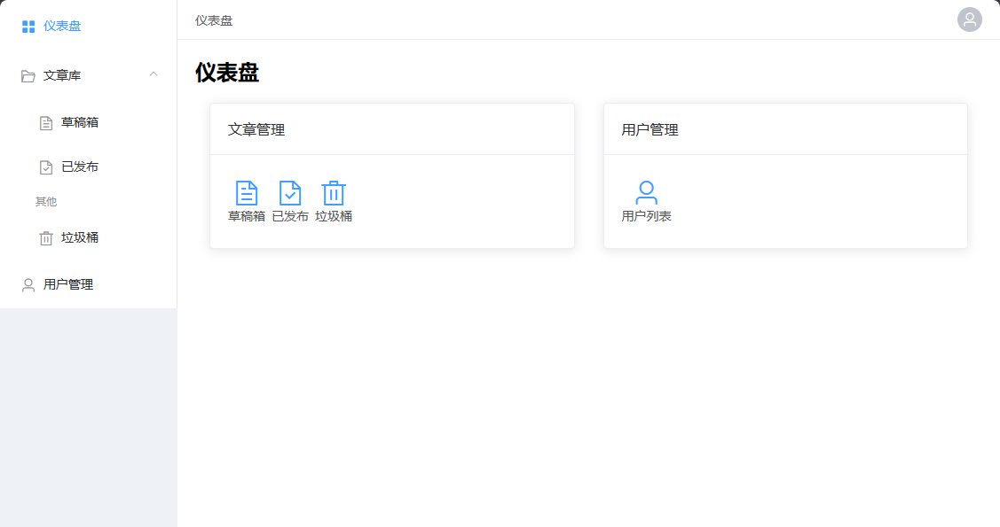

# navi-maker-example

navi-maker的一个管理后台例子

## 特性

路由和导航使用[navi-maker](https://github.com/lpreterite/navi-maker)进行统一管理，并再提供一些常规的功能例子。

- 页面标题随着路由变化
- 面包屑导航
- 侧边栏导航
- 路由权限控制（登录）
- 明细页面导航和路由设置
- 导航图标设置

目前使用的是[ElementUI](https://element.eleme.cn/#/zh-CN)作为例子，navi-maker也可以结合使用其他UI框架来构建完整的信息架构。

## 预览




## Develop

```
npm install

npm run serve

npm run build

npm run lint
```

### Customize configuration
See [Configuration Reference](https://cli.vuejs.org/config/).
